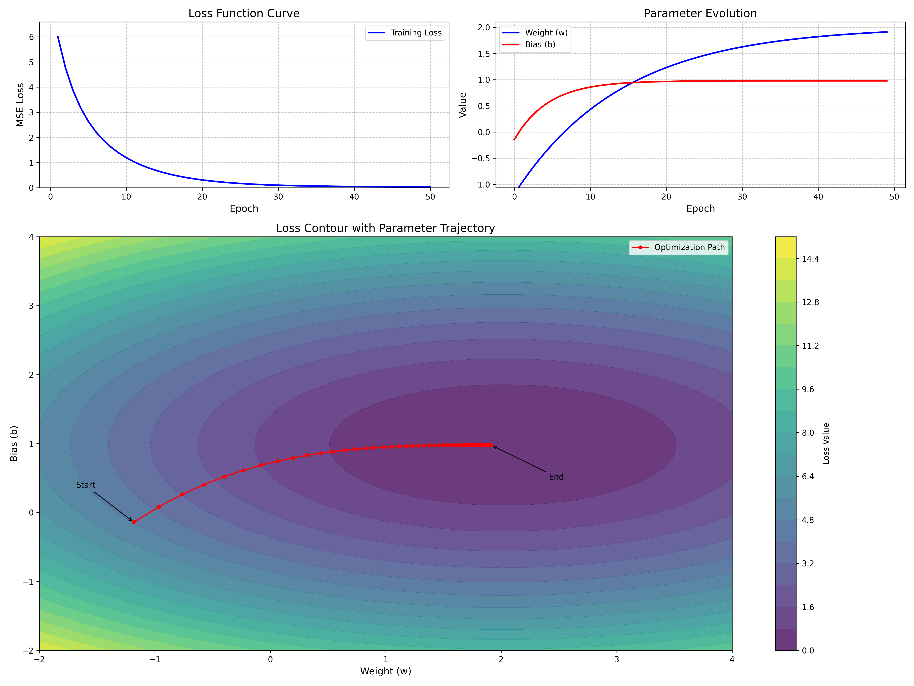
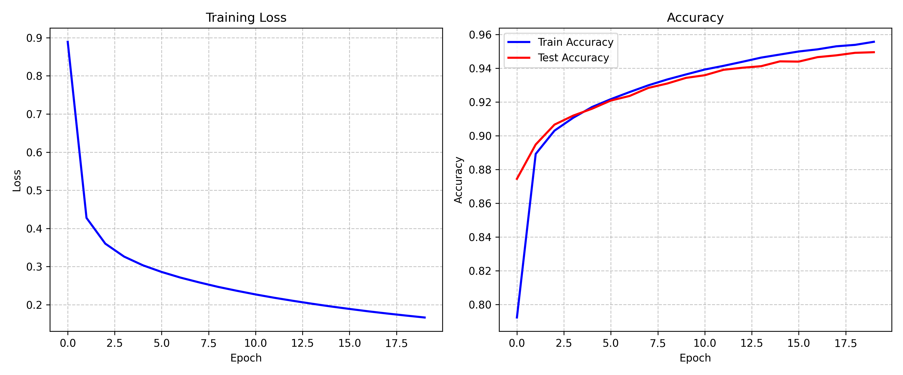

# NPNN: A Ultra Lightweight Neural Network Engine based on NumPy

## TODO List

- [DONE] Gradient Descent & Backward Propagation Algorithms
- [DONE] Minimum Operators
- [DONE] Minimum Optimizer & Loss Criterions
- [PEND] Further Implementations (e.g. Adam, BatchNorm, CNNs, RNNs, Attention mechanism, etc.)


## Install Requirements

```requirements
python>=3.7
scikit-learn
matplotlib
numpy
```

## Run Tests

```bash
pip install scikit-learn matplotlib numpy
python test_mnist.py
```

## Results



